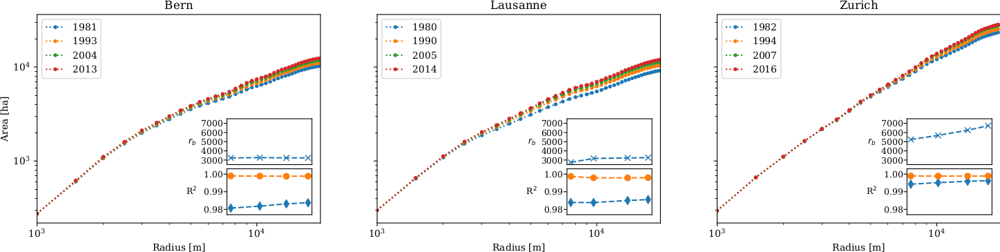

[](https://travis-ci.org/martibosch/swiss-urbanization)
[](https://mybinder.org/v2/gh/martibosch/swiss-urbanization/master?filepath=notebooks)

Spatiotemporal patterns of urbanization in Switzerland
==============================

Materials to reproduce the article:

Bosch M., Jaligot R., Chenal J. 2020. "Spatiotemporal patterns of urbanization in three Swiss urban agglomerations: insights from landscape metrics, growth modes and fractal analysis". *Landscape ecology*. [10.1007/s10980-020-00985-y](https://doi.org/10.1007/s10980-020-00985-y)



## Instructions to reproduce

### Option 1: via MyBinder

Click the badge below, which will use [MyBinder](https://mybinder.org/) to launch a server with a Jupyter executable environment:

[](https://mybinder.org/v2/gh/martibosch/swiss-urbanization/master?filepath=notebooks)

### Option 2: locally

1. Clone the repository and change directory to the repository's root:

```bash
git clone https://github.com/martibosch/swiss-urbanization
cd swiss-urbanization
```

2. Create the environment (this requires conda) and activate it:

```bash
conda env create --name swiss-urbanization -f environment.yml
# the above command creates a conda environment named `swiss-urbanization`
conda activate swiss-urbanization
```

3. Register the IPython kernel of the `swiss-urbanization` environment

```bash
python -m ipykernel install --user --name swiss-urbanization --display-name "Python (swiss-urbanization)"
```

4. Now you might use `make` to generate all the figures in the directory `reports/figures` as in:

```bash
make figures
```

or instead launch Jupyter as in:

```bash
jupyter-notebook
```

and generate the figures interactively by executing the notebooks of the `notebooks` directory.

### Important note

The `landscape_plots.pdf` figure cannot be reproduced with the current environment (see the file `environment.yml`) because of [the incompatibility between the basemap installed from `conda-forge` and pyproj 2.0](https://github.com/matplotlib/basemap/pull/454).

------------------------------

<p><small>Project based on the <a target="_blank" href="https://drivendata.github.io/cookiecutter-data-science/">cookiecutter data science project template</a>. #cookiecutterdatascience</small></p>
